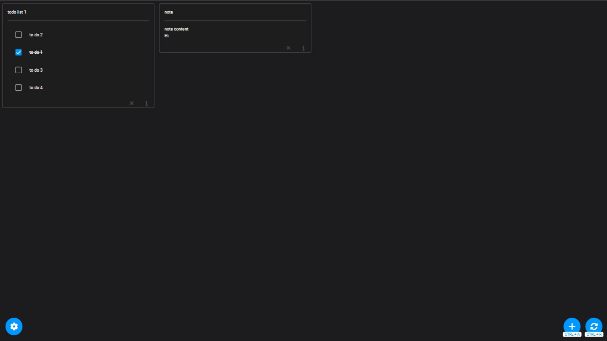

# kDrive Notes & To-do lists
- Manage your notes and to-do lists in a simplified interface.
- The application connects to your [Infomaniak kDrive](https://kdrive.infomaniak.com) via webDAV.
- If you want a more sophisticated solution, take a look at [Joplin](https://github.com/laurent22/joplin). A guide is available [here](https://www.infomaniak.com/fr/support/faq/1800/synchroniser-les-notes-joplin-par-webdav-avec-kdrive)

## Preview


## How to
- [How to install PWA (PC and Phone)](doc/PWA.md)
## Android version [here (alpha)](https://play.google.com/store/apps/details?id=fr.zkf.kdrive_notes)

## Setup infos
- The default folder is `WebDAVJS`, please create it at the root of your kDrive.

## Install the dependencies
```bash
yarn
# or
npm install
```

### Start the app in development mode (hot-code reloading, error reporting, etc.)
```bash
quasar dev
```

### Lint the files
```bash
yarn lint
# or
npm run lint
```

### Format the files
```bash
yarn format
# or
npm run format
```


### Build the app for production
```bash
quasar build
```

### Customize the configuration
See [Configuring quasar.config.js](https://v2.quasar.dev/quasar-cli-vite/quasar-config-js).

## Links
- https://kdrive-notes.netlify.app
- https://www.infomaniak.com/fr/support/faq/2409/se-connecter-a-kdrive-via-webdav
